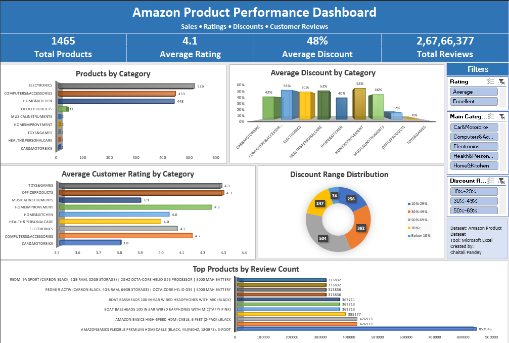

# 📊 Amazon Product Performance Dashboard

An interactive Microsoft Excel dashboard built to analyze Amazon product data using Pivot Tables, Pivot Charts, KPI Cards, Slicers, and Excel formulas.



---

## 📌 Project Overview

The **Amazon Product Performance Dashboard** is an interactive Microsoft Excel dashboard built to analyze Amazon product data and extract meaningful business insights.

The dashboard transforms raw product information into an easy-to-understand visual report using Pivot Tables, Pivot Charts, KPI Cards, and Slicers. It enables users to explore product categories, customer ratings, discount trends, and review counts through an interactive interface.

This project demonstrates practical Excel skills commonly used in Data Analysis and Business Intelligence roles.

---

# 🎯 Project Objectives

- Analyze Amazon product performance
- Compare products across different categories
- Evaluate customer ratings
- Study discount patterns
- Identify the most reviewed products
- Build an interactive dashboard using Microsoft Excel

---

# 📂 Dataset Information

**Dataset Name:** Amazon Product Dataset

The dataset contains information such as:

- Product ID
- Product Name
- Product Category
- Actual Price
- Discounted Price
- Discount Percentage
- Customer Rating
- Rating Count

**Dataset Source:** Kaggle

---

# 🛠 Tools & Technologies Used

- Microsoft Excel
- Excel Tables
- Pivot Tables
- Pivot Charts
- Slicers
- KPI Cards
- Excel Formulas
- Conditional Formatting

---

# 📈 Dashboard Features

### KPI Cards

- Total Products
- Average Customer Rating
- Average Discount
- Total Customer Reviews

### Interactive Filters

- Rating
- Main Category
- Discount Range

### Visualizations

- Products by Category
- Average Discount by Category
- Average Customer Rating by Category
- Discount Range Distribution
- Top Products by Review Count

---

# 💡 Key Business Insights

A detailed business analysis is available in:

📄 **[insights.md](insights.md)**

Some key findings include:

- Electronics contains the highest number of products.
- The average discount across products is approximately **48%**.
- Customer ratings remain consistently above **4.0** across most categories.
- Most products fall within the **50–69% discount range**.
- A small number of products account for the majority of customer reviews.

---

# 📁 Project Structure

```
Amazon-Product-Performance-Dashboard/
│
├── dashboard/
│   └── Amazon_Product_Performance_Dashboard.xlsx
│
├── data/
│   └── amazon.csv
│
├── visuals/
│   ├── dashboard_preview.png
│   ├── products_by_category.png
│   ├── average_discount.png
│   ├── average_rating.png
│   ├── discount_distribution.png
│   └── top_reviewed_products.png
│
├── insights.md
├── README.md
└── LICENSE
```

---

# 🚀 How to Use

1. Clone or download this repository.
2. Open **Amazon_Product_Performance_Dashboard.xlsx** from the **dashboard** folder.
3. Use the slicers to filter the dashboard interactively.
4. Explore product categories, ratings, discounts, and review counts.
5. Read **insights.md** for detailed business findings.

---

# 📚 Skills Demonstrated

This project showcases practical skills in:

- Data Cleaning
- Data Preparation
- Data Analysis
- Dashboard Design
- Data Visualization
- Business Intelligence
- KPI Design
- Pivot Tables
- Pivot Charts
- Interactive Reporting
- Microsoft Excel

---

# 🎓 Learning Outcome

Through this project, I gained hands-on experience in transforming raw business data into an interactive dashboard capable of supporting data-driven decision-making.

The project strengthened my understanding of Excel's analytical capabilities and reinforced best practices in dashboard design, business reporting, and visual storytelling.

---

# 👩‍💻 Author

**Chaitali Pandey**

Bachelor of Information Technology

Aspiring Data Analyst

---